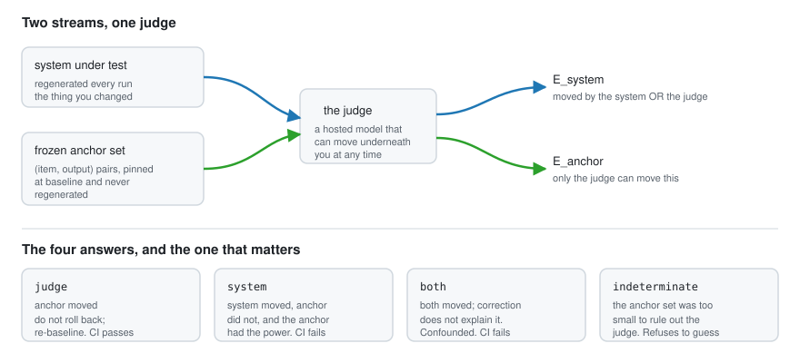

<!-- GENERATED by scripts/gen_readme.py. Do not edit by hand. -->
# Benchlock

**Your eval score dropped. Benchlock tells you whether your system regressed or the judge
changed underneath you — with a guarantee that survives looking every day.**

A *bench mark* is a surveyor's fixed reference, cut into stone so every other measurement
can be taken from it. Benchlock cuts one into your eval pipeline and locks it, so that when
a number moves you can tell whether the wall shifted or the ruler did.

---

## In plain language

### The pain

You run an AI system. To check it is any good, you keep a set of test questions and have
**another AI — a "judge" — grade the answers.** It runs on every code change and produces
one number: a pass rate.

One Tuesday that number drops by twelve points.

The dashboard says **regression**. An engineer spends a week bisecting commits and finds
nothing — because **nothing in the system changed.** The provider quietly updated the judge
model behind the same model name. The ruler shrank; the wall never moved.

It cuts both ways:

- **False alarm** — a healthy release is rolled back, or a week goes on hunting a ghost.
- **Missed alarm** — a real bug ships, because everyone has learned to shrug and say *"the
  judge is being weird again."*

There is a second, quieter problem underneath. Even a team that runs a proper statistical
test on each run is **looking at that number every single day**, and statistical tests are
not built for that. Look often enough and you will eventually see a "significant" result by
chance alone — flip a coin all afternoon and five heads in a row is guaranteed.

### What nobody could tell you

1. **Did my system get worse, or did the judge change?**
2. **After two hundred daily glances at this dashboard, how often have I been fooled?**

### What Benchlock adds: a control group

> Freeze a set of answers — say two hundred of them — and never touch them again. Every
> run, ask the judge to re-grade those exact same frozen answers.

The system under test cannot affect them; they are frozen. So:

| what moved | what it means |
|---|---|
| the frozen set | **only the judge can have done it** — do not roll back |
| the system, and not the frozen set | **the system really regressed** — fail the build |
| both | **tangled** — Benchlock says so instead of guessing |
| the frozen set was too small to be sure | **Benchlock refuses to answer** |

The last row is the important one. If the control group was too small to have *noticed* a
judge change, then "your system broke" is a guess even when it happens to be right.
Benchlock says `indeterminate` and tells you how many frozen answers you would have needed.
A tool that is confidently wrong one time in ten is worse than useless in CI, because
people learn to ignore it.

And instead of ordinary statistics it uses mathematics built for people who peek: the
guarantee holds *however many times you look*.

### Does it work?

Everything below is measured — the first two by simulation with known ground truth, the
last two against real judges — with the commands in this repository:

- The everyday approach, a t-test on every commit, **raises a false alarm on
  21.2% of perfectly healthy pipelines.** Benchlock: **0.0%**.
- When only the judge moved, the everyday approach says "regression"
  **100%** of the time. Benchlock says `judge` **100%** of the time.
- **A real judge at its most deterministic setting disagrees with itself
  18.9% of the time.** Ask it the identical question twice and
  one time in 5 you get a different score. That is the whole problem, measured.
- On 6 scenarios built from real judge scores, Benchlock got **5**
  right. The best competing method got 2.

### What it costs

**Benchlock is about 8× slower to spot a real regression** than the
everyday method — 24.6 runs on average against 3.1. That is the price of
a guarantee that survives daily looking, and it is a headline row in
[RESULTS.md](RESULTS.md), not a footnote. If a false rollback is cheap for you and slow
detection is expensive, the everyday method is genuinely the better tool.

6 of the 8 attacks designed against it still work.
They are published below, with their measured failure rates.

---

## The phantom regression

A team's eval pass rate falls over two weeks. The dashboard flags a regression and the
on-call engineer starts bisecting.

```text
$ benchlock verdict
verdict=judge          confidence: anytime-valid at alpha=0.05
  E_anchor    =    17222.4   (threshold 40.0, crossed at run 34)
  E_system    =    58382.5   (threshold 40.0, crossed at run 29)
  E_corrected =        0.5   (threshold 40.0; the system move with the judge's removed)

- the anchor set moved -0.088 [CS: -0.155, -0.020]
- the system under test does not touch the anchor set; only the judge can move it
- your system moved -0.092 raw; anchor-corrected +0.001 [CS: -0.067, +0.069]
- anchor provisioning: ADEQUATE
  minimum detectable judge shift at this anchor size = 0.032, over 55 monitored run(s) of 200
  anchor items
- judge: claude-sonnet-4-5-20250929 (config unchanged all epoch)

DO NOT roll back. Re-baseline against the judge's current behaviour:
  benchlock rebaseline --reason judge-version-change
```

Ground truth: the provider rotated the judge snapshot behind a stable model string. The
system under test was byte-identical throughout. **The rollback would have been pure waste,
and `benchlock gate` exits 0 — a judge change must not fail your build.**

Two more demos, including the one this project actually exists for, are in
[docs/demo.md](docs/demo.md).

---

## Two numbers, from simulation

Both tables below come from **simulated streams** with known ground truth — a generator
whose judge noise and drift are chosen, so the right answer is known and the false-alarm
rate can be counted exactly. Real-judge results, which are a separate and smaller study,
are in the section after this one.

### 1. Peeking

Over 500 drift-free streams, each inspected after **every one** of
142 runs, at `alpha=0.05`:

| method | raises at least one false alarm on |
|---|---:|
| t-test re-run every run | **21.2%** of healthy pipelines |
| the same, Bonferroni-corrected | **7.4%** |
| **Benchlock** | **0.0%** |

Peeking is not a misuse of the t-test here — it *is* the workflow. CI runs on every commit
and someone looks at the number every time. A test with a fixed alpha, re-run at every
accumulating observation, has no type-I error control at all.

### 2. Attribution

The same pipeline, with the *judge* shifted and the system under test byte-identical:

| method | what it concludes |
|---|---|
| t-test re-run every run | "regression", **100%** of the time |
| Benchlock **without** an anchor set | "regression", **100%** of the time |
| **Benchlock** | `judge`, **100%** of the time |

Single-stream methods have no attribution available to them. Watching one number, the only
conclusion reachable is "it moved" — a structural fact about the method, not a criticism of
anyone using it. The middle row is Benchlock with its own control group removed, which is
the honest measure of what the anchor set costs and buys.

Full tables, including every baseline and the cases where Benchlock loses, are in
[RESULTS.md](RESULTS.md).

---

## Against real judges

A smaller study, and a real one: 400 HelpSteer2 items scored by `claude-sonnet-5` and
`claude-haiku-4-5` under four configurations — 2,456 calls, $3.05.

**A judge at its most deterministic setting disagrees with itself 18.9% of the time.**
Ask it the identical question twice and one time in five you get a different score. That is
the noise floor the whole tool is measured against, and it is not zero.

**Editing only the rubric text raised the judge's *refusal* rate 6.67×**
(from 2.2% to 15.0% of the same 400 items).
A refused item leaves the sample silently, and Benchlock does not watch for that — it is
listed under limitations below.

On six scenarios composed from those real scores, **Benchlock got 5 right; the best
single-stream baseline got 2.** The one Benchlock missed is the configuration change
that moved refusals rather than scores. The streams are constructed by resampling real judge
scores, not observed longitudinally, and the system-regression scenarios subtract a fixed
amount from real scores rather than degrade a real system — both stated in
[RESULTS.md](RESULTS.md).

---

## [Attacks that work against Benchlock](docs/threat-model.md)

Measured, not estimated. This is near the top rather than in an appendix because you should
know what beats it before you install it.

| attack | what it does | failure rate |
|---|---|---:|
| 7.1 anchor evasion | a judge change confined to a region the anchor set does not cover | **100%** |
| 7.4 anchor staleness | the team's own standard changed; frozen anchors read it as judge drift | **100%** |
| 7.5 input distribution shift | the eval suite itself moves, adding a third cause benchlock cannot model | **100%** |
| 7.9 provider-side response caching | a cached judge returns yesterday's answers, hiding real drift | **100%** |
| 7.3 cancellation | judge and system moving in opposite directions; the net score is flat | **25%** |
| 7.2 slow ramp | drift introduced gradually, below the per-run detectable threshold | **20%** |
| 7.6 adversarial ordering | worst-case ordering of observations within each run | **0%** |
| 7.7 heavy tails and bound violations | near-degenerate score distributions and out-of-range scores | **0%** |

**Anchor evasion is the fundamental limitation.** A judge change confined to a region your
anchor set does not cover is invisible: the system stream moves, the anchor stream does
not, and Benchlock says `system` — a confident, wrong rollback recommendation. Coverage is
measured and warned about. It is never guaranteed. Reproduce with
`uv run python bench/adversarial/run_adversarial.py --all`.

---

## The mechanism, in three lines



Hold a frozen anchor set that the system under test never touches, and have the judge
re-score it every run.

- the anchor score moved ⇒ **only the judge can have moved it**
- the system score moved and the anchor did not ⇒ **the system moved**
- both moved ⇒ **confounded**, and Benchlock says so rather than picking

That is a difference-in-differences design where the anchor set is the control group and
the judge is the shared time effect. It is not clever; it works because it is deterministic
and needs no model to adjudicate it. Wrapping it in anytime-valid sequential tests is what
makes the verdict survive daily peeking.

**No human labels are required.** Attribution needs judge *stability*, not judge *validity*
— so a snapshot of the judge's own scores is a sufficient control. The argument is written
out in [docs/identification.md](docs/identification.md).

---

## Install

```sh
uv tool install benchlock
```

```sh
benchlock init                                   # detects promptfoo / Inspect AI / DeepEval
benchlock baseline --anchors your-suite.jsonl    # freezes anchors, measures the noise floor
benchlock plan --target-shift 0.05               # how many anchors you actually need
benchlock observe results.jsonl --rescore-anchors
benchlock gate                                   # the last line of your CI job
```

Exit codes: `0` for `stable` and `judge`, `1` for `system` and `both`, `2` for
`indeterminate`. A judge change does not fail your build; it tells you to re-baseline.

There is a [GitHub Action](.github/actions/benchlock/action.yml) that runs the whole
sequence and posts the verdict as a PR comment.

---

## The five verdicts

| verdict | meaning | CI |
|---|---|---|
| `stable` | neither process has crossed | pass |
| `judge` | the judge moved | pass — re-baseline, do not roll back |
| `system` | the system moved, and the judge demonstrably did not | **fail** |
| `both` | both moved; the correction does not explain the system's move | **fail** |
| `indeterminate` | the anchor set could not rule out the judge | warn |

`indeterminate` is the one that makes the other four mean anything. Without it, a tool
whose anchor set was too small to rule out the judge would still say `system`, and be right
by luck often enough to be believed. **A tool that is confidently wrong one time in ten is
worse than useless in a CI gate, because people learn to ignore it.**

---

## Prior art

**["Who Drifted: the System or the Judge? Anytime-Valid Attribution in LLM Evaluation
Pipelines" (arXiv 2606.15474, June 2026)](https://arxiv.org/abs/2606.15474) states this
problem, proposes the anchor-set and e-process construction, and reports a three-way
verdict.** It is the intellectual source for this project. It is a solo-authored,
unaffiliated preprint with no public code and no third-party reproduction; its anchor sets
are human-labeled, which is a multi-week adoption cost; it has no state for "I cannot
tell"; and it gives no method for sizing the anchor set.

**The mathematics is not ours.** Ville's inequality (1939) is the entire guarantee. Howard,
Ramdas, McAuliffe & Sekhon gave the time-uniform bounds and confidence sequences;
Waudby-Smith & Ramdas gave the betting construction we use, and their `confseq` package is
our test oracle; Grünwald, de Heide & Koolen framed e-values as the right object; Shin,
Ramdas & Rinaldo's e-detectors are the change-detection primitive. None of it knows what an
LLM judge is.

**Prediction-powered inference** (Angelopoulos et al., *Science* 2023) is the closest
statistical cousin, and `human` anchor mode is essentially PPI applied to judge scores.

**LLM drift tools** (`llm-drift`, `driftmonitor-ai`, `dedrift`) do embedding and output
diffing with classical fixed-sample tests; `dedrift` paywalls its e-process layer. **None of
them attribute.** They tell you a number moved, which is the easy half.

**Eval platforms** (promptfoo, DeepEval, Braintrust, LangSmith, Phoenix, Langfuse, Weave,
Evidently, RAGAS, Inspect AI) compute, store and compare scores, some with threshold alerts.
**None is valid under repeated looking, and none has a control group.** They are the
substrate Benchlock plugs into, not competitors — there are adapters for several of them.

**Classical change detection** (CUSUM, ADWIN, DDM) detects single-stream change with no
notion of *which of two causes* produced it. They are baselines in [RESULTS.md](RESULTS.md),
not prior art we extend.

**What is ours:** the first installable implementation of judge-versus-system attribution;
the observation that attribution needs judge stability rather than validity, which removes
the labelling requirement entirely; and the provisioning rule plus the `indeterminate`
verdict, which together are the difference between a guarantee and a decoration.

---

## Known limitations

- **Anchor evasion is the fundamental limitation.** A judge change confined to a region your
  anchor set does not cover is invisible — measured at **100%** in the worst case.
  Coverage is measured and warned about; it is never guaranteed.
- **Benchlock tells you *that* the judge changed, never *why*.** A provider rotation and a
  teammate's rubric edit are indistinguishable unless you declared one of them.
- **`frozen-self` anchors detect judge instability, not judge invalidity.** A judge that was
  always wrong stays wrong and reads as stable. Benchlock does not claim your evals are
  correct.
- **Your own standards changing reads as permanent judge drift** until you re-baseline. The
  tool warns; it does not solve.
- **The guarantee is time-uniform, not instantaneous.** Anytime-valid tests detect *later*
  than invalid ones. That is the price, and it is measured in [RESULTS.md](RESULTS.md)
  rather than hidden.
- **A fixed suite is required.** If your eval inputs are sampled from shifting production
  traffic, score movement has a third cause Benchlock does not model — and the suite-hash
  check sees item ids, not item content, so it cannot catch every version of this.
- **Bounded scores only.** Rubrics must declare their range and stay inside it.
- **Needs a stream.** Nothing useful for a single run; `min_runs` defaults to 8 for a reason.
- **Nothing for pipelines with no LLM judge.** Programmatic scorers with no model in them do
  not drift, which is a good argument for using them where you can.
- **A judge that got noisier without changing its mean is not reported as a judge change.**
  The reasoning is in [docs/threat-model.md](docs/threat-model.md); a dedicated
  variance-change warning is not implemented.
- **Benchlock does not watch the judge's *refusal* rate**, only its scores. Measured
  against a real judge, editing the rubric alone raised the refusal rate 6.7x — and a
  refused item vanishes silently from the sample, so a score-only tool cannot see it.
  See [RESULTS.md](RESULTS.md).
- **A judge configuration change that moves refusals but not scores is invisible.** Raising
  the judge's reasoning effort tripled its refusal rate while barely moving the mean score,
  and Benchlock returned `stable` — one of six real-judge scenarios it gets wrong.
- **Single judge, single suite, single system.** Ensembles and portfolios are v2.
- **The promptfoo / Inspect AI / DeepEval adapters were tested against fixtures built from
  each project's documented output shape, not captured from real runs.** A schema that has
  drifted from its docs would pass those tests and fail in the field. An unrecognised shape
  is refused, never guessed at.
- **The GitHub Action has not been exercised on a real GitHub runner.** CI runs the same CLI
  sequence directly (`scripts/dogfood.py`); the composite action wrapping it is untested
  end to end.

---

## Docs

- [The identification argument](docs/identification.md) — what is claimed, and the
  assumptions it rests on
- [Statistical guarantees](docs/statistical-guarantees.md) — what is guaranteed, what is
  not, and our own measured false-alarm rates
- [Provisioning](docs/provisioning.md) — how to size an anchor set, with worked examples
- [Threat model](docs/threat-model.md) — what breaks this
- [RESULTS.md](RESULTS.md) — every benchmark number, generated

## License

Apache-2.0.
